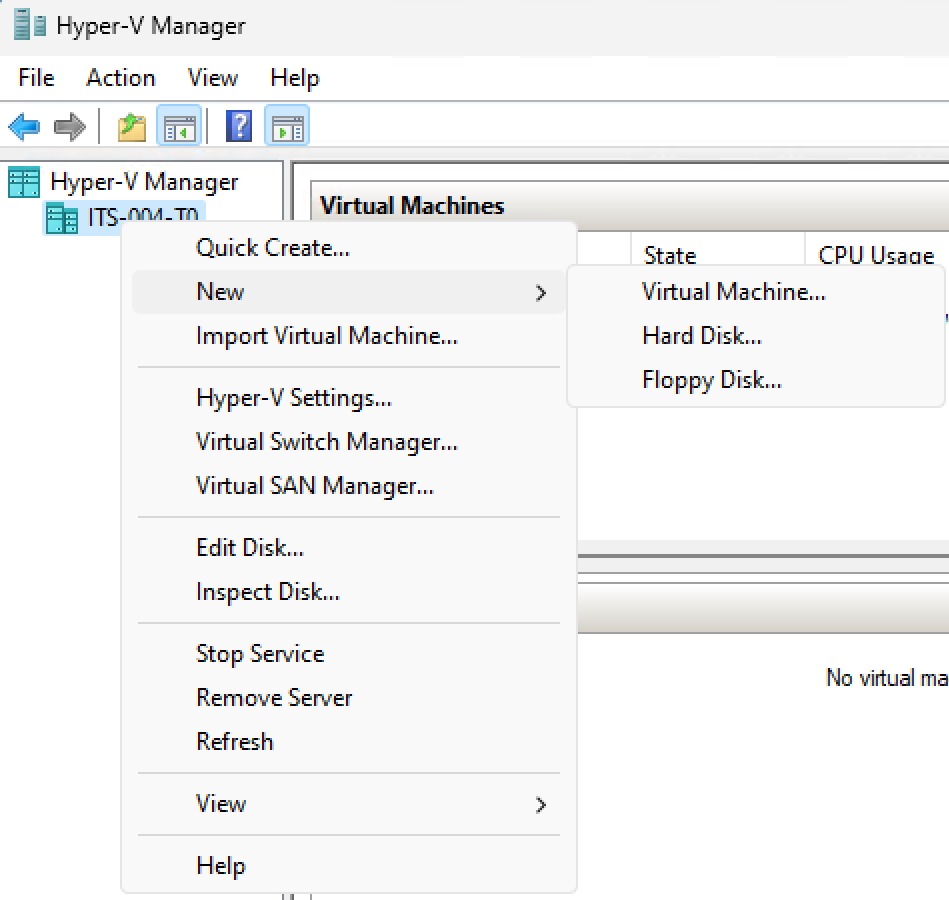
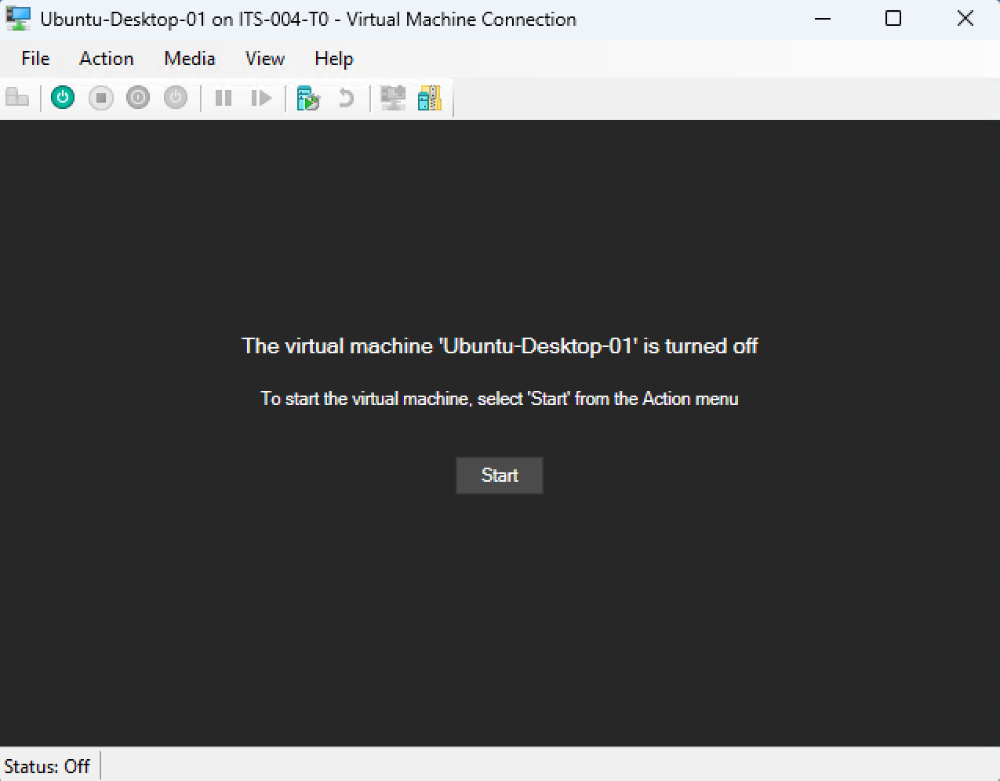

## VM-Creation and OS Installation

### Goals 
-   Creation of Virtual Machines (VM) on a lab workstation
-   Installation of either Ubuntu-Desktop or Windows inside VM

### Pre-Lab
-   Dr. Bowie's lecture on Virtual Machine concepts

### Resources
-   Hyper-V (part of Windows 11 Enterprise/Pro)
-   ISO files of Ubuntu-Desktop and Windows 11 in the C:\OS folder of each machine

### Task 0 - Destruction of University Lab Machines
Please note that this work is done on university machines so YOUR machine doesn't get broken become non-functional. Please don't TRY and break the lab machines... however, that is their purpose is to have students do weird things on them. 

TL;DR - Try not to break the lab machines, but don't worry too much if something goes off the rails. Get and instructor and we'll help fix it. (Learning Moment!)

### Task 1 - Virtual Machine Creation
This task will walk you through the steps of creating the virtual machine (VM). This is the software construct that the operating system (OS) will install into. It defines all the virtualized hardware that the OS will "see".

1. On the start menu search for "Hyper-V Manager" (blue icon that looks like a bigger and smaller PC next to each other). This console is the primary interface for working with VMs in Hyper-V. It is possible to work with VMs at the CLI (in this case it would be PowerShell), for now that's beyond the scope of this lab.

    The console contains a left and right side pane and three horizontal panes in the center. 
    **Left Pane:** Hierarchial listing of Hyper-V servers (in case you were connected to any remote Hyper-V servers)
    **Top Pane:** Virtual Machines: Listing of all current VMs on selected Hyper-V server
    **Middle Pane:** Checkpoints: Listing of Check Points (Snapshots) of currently selected VM
    **Bottom Pane:** Details: Details about items of the selections made above
    **Right Pane:** Actions: Options for any selection made. Think of this pane as normal pull-down menus in an application like MS-Word.
     
    
 

2. Right-Click on the computer name in the left most pane and select New -> Virtual Machine. This will start the "New Virtual Machine Wizard".
     
    
 

3. `Title: Before You Begin` The first screen is informational, press Next after reading. 

4. `Title: Specify Name and Location` The second option is selecting a Name for the virtual machine. I suggest `Ubuntu-Desktop-01`. Also check the box labeled `Store virtual machine in a different location`. In the `Location:` option use `C:\VM`. Then press the Next button.
     
    
     

5. `Title: Specify Generation` The choice of which generation of VM to use is a technical choice that will depend on the type of environment that you need to build. This is an interesting discussion but beyond the scope of this lab. Take the default option `Generation 1` and press the Next button.
 

6. `Title: Assign Memory` This dialog provides for the selection of RAM (memory) available to the VM. This option can be changed later (more or less). For now provide the VM with 2048 MB (2GB) of RAM. Set `Startup memory:` to 2048 and leave the other options at their default settings. Press the Next button.
 

7. `Title: Configure Networking` This dialog allows for the selection of which virtual switch. In main console there are options to setup additional virtual switch to allow for more networking options. For now use the pull-down menu and select `Default Switch` to use the virtual switch that is created when Hyper-V is installed.
 

8. `Title: Connect Virtual Hard Disk` This dialog allows for the creation of Virtual Hard Disks (vHD) as well as the connection to existing vHDs. Change the `Size:` option to `50` GB and press the Next button.
 

9. `Title: Installation Options` This dialog allows for the selection of install media. In our case that will be the Ubuntu Desktop ISO file in the C:\OS folder. Select the radio option `Install an operating system from a bootable CD/DVD-ROM`. Then select the sub-radio button for `Image file (.iso)`. In the path provide `C:\os\ubuntu-22.04.3-desktop-amd64.iso` as the path to the ISO file. Then press the Next button.
     
    
     

10. `Title: Completing the New Virtual Machine Wizard` This provides a summary of choices and an opportunity to go back and make changes if needed via the `Previous` button. Press the `Finish` button to complete the creation of the VM. If you receive any error message please contact an instructor for help.
 

11. Once completed the console should appear similar to the one shown below.
     
    
     

### Task 2 - OS Installation
12. To start the VM right-click on the VM and select the top choice, `Connect`. 
     
    
     

13. `Connect`` opens a child window that is the console (i.e., monitor) for the VM. Use the `Start` button on the console to start the boot-up process of the VM.
     
    
     

14. This should start the normal installation process for the selected Operating System. The initial process can take a bit of time so be patient! Ubuntu-Desktop uses a GUI installer that leads the user through the process of installing the OS. Eventually the user should be left at the screen shown below. Select `Install Ubuntu` to start the process. Follow the prompts using your best judgement. Ask questions if you need to. Remember this is just a VM it can be easily deleted and build a new one if something goes wrong. Feel free to experiment!
     
    
     

15. When finished with a VM go to the Hyper-V console right-click on the VM and select `Shut Down...`
     
    
     
